# CS2WPF
## Free Open Source Rapid Application Development tool
- CS2WPF helps a developer create an enterprise data management application without coding
    - The developer starts with Db Entities (Entity Framework).
    - Using DBContext Wizard the developer creates or modifies existing Dbcontext.
    - Using ModelViews Wizard the developer creates or modifies existing ModelViews. In terms of this documentation, the ModelView for a given database entity is a C # class with a subset of properties of the given entity and direct and indirect master entities (One-to-many relation introduce two roles for entities: master entities and detail entities). "ModelView" is the C # analogue of SqlView in a database.
    - Using WebApiServices Wizard the developer defines and generates AspNet Web Api Services. 
    - Using Wpf Forms  Wizard the developer defines and generates rich client interface as Wpf user controls.
    - Using FeatureScripts Wizard arranges generated Wpf user controls on the pages.
- The developer uses DBContext, ModelViews and WebApiServices Wizards to create the back end of the project.
- The developer uses Wpf Forms and FeatureScripts Wizards to create Rich Client Application.
- Rich Client Application Wizards uses the Prism framework to create loosely coupled, maintainable, and testable XAML applications.

## CS2WPF is implemented as Microsoft Visual Studio Extension (.vsix) and consists of five wizards:
1. DBContext Wizard
2. ModelViews Wizard
3. WebApiServices Wizard
4. Wpf Forms Wizard
5. FeatureScripts Wizard
- Each wizard includes the modeling UI forms and a code generator to produce XAML and C# files.

### Talking about "generators":
- Generators are built on the basis of "T4 Text Template"-Microsoft technology.
- As a result, the developer can modify or rewrite any T4 script at any time.
- The latter makes CS2WPF an extremely flexible application development tool that speeds up the development process by several times.

### Wizard's project files:
- For each Dbcontext, ModelViews Wizard creates special json file that acts as a CS2WPF Forms project file. If the CS2WPF Forms project file already exists all CS2WPF Wizards read and write the data to this file.
- For each Dbcontext, the FeatureScripts Wizard creates additional json file that acts as a CS2WPF Feature's project file. Only FeatureScripts Wizard reads and writes data to CS2WPF Feature's project file.
- Both CS2WPF project files are saved in the root folder of the Microsoft Visual Studio solution.
- If a developer adds a new Dbcontext to the solution and runs the ModelViews wizard or FeatureScripts wizard, then two additional CS2WPF project files are added to the solution.

### Table of content
#### [Programming tools used to start the development  process](#Programming-tools-used-to-start-the-development-process.)
#### [Preparing the development  environment](#Preparing-the-development-environment.)
#### [Creating projects to start back end  development](#Creating-projects-to-start-back-end-development.)
#### [Creating projects to start front end  development](#Creating-projects-to-start-front-end-development.)
#### [References of the front end  projects](#References-of-the-front-end-projects.)
#### [NuGet packages of the front end  projects](#NuGet-packages-of-the-front-end-projects.)
#### [NuGet packages of the back end  projects](#NuGet-packages-of-the-back-end-projects.)
#### [First entity and  Dbcontext](#First-entity-and-Dbcontext.)
#### [First View and Wizard  repository](#First-View-and-Wizard-repository.)
#### [First Web Api  Service](#First-Web-Api-Service.)

## Programming tools used to start the development process.
### The following Programming tools must be used to begin development:
- Microsoft Visual Studio 2019 (community edition or higher) (https://visualstudio.microsoft.com/vs/)
- Prism Template Pack (https://github.com/PrismLibrary/Prism)
- WPF AutoComplete TextBox (https://github.com/quicoli/WPF-AutoComplete-TextBox)
- CS2WPF Visual Studio Extension (https://github.com/chempkovsky/CS2WPF)
- It is highly recommended to install in your network or virtual environment the following software:
    - MSSQL 2019 Developer Edition (Free Server)
    - SQL Server Management Studio 18.5 (Free Studio)


## Preparing the development environment.
1. Install and Run Microsoft Visual Studio 2019
2. With "Extensions/Manage Extensions"-menu run the Visual Studio "Manage Extensions"-Wizard
3. With Visual Studio "Manage Extensions"-Wizard install Prism Template Pack (https://github.com/PrismLibrary/Prism)
4. Download CS2WPF-binary (https://github.com/chempkovsky/CS2WPF) and run installation. Later, using the Visual Studio "Manage Extensions" -Wizard, the developer can remove the CS2WPF-Extension.

## Creating projects to start back end development.
1. Run Microsoft Visual Studio 2019
2. With "File/New/Project"-menu run "Create New Project"-Wizard
3. Type "solution" in the "Search for templates"-control
4. Choose "Blank Solution"-item and click "Next"-button


5. On "Configure Your New Project"-page type "CS2WPFTestSolution" for Solution name, choose the folder you like and click "Create"-button

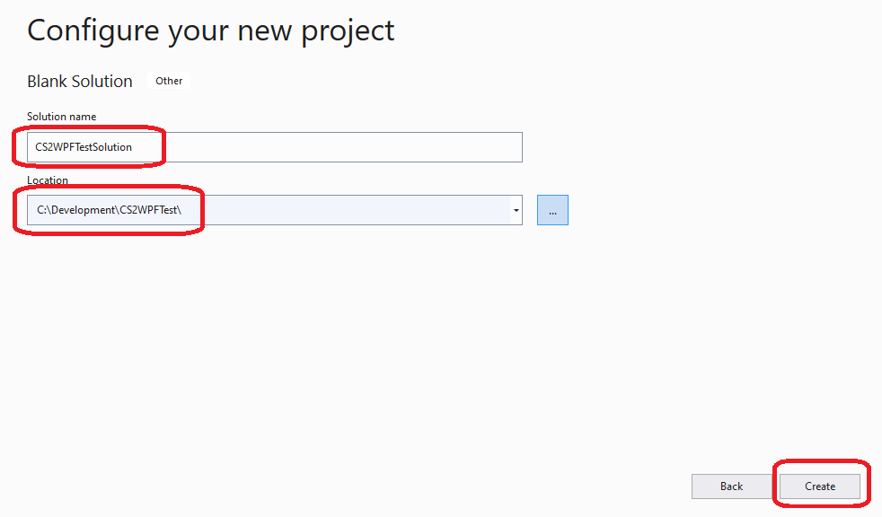

6. Right click Solution root node and choose "Add/New Solution folder"


7. Type "ClientProjects". Repeat step 6 and type "ServerProjects". The result is shown on the picture below.

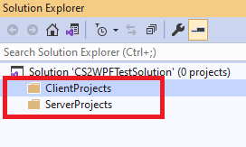

8. Right click "ServerProjects"-folder and "Add/New Project"


9. On the "Add New project" page select C#, type "class library", choose "Class library (Net Framework)"-item and click "Next"-button


10. On "Configure Your New Project"-page type "DbEntitiesClassLibrary", select "4.7.2" and click create


11. Delete the "Class1.cs"


12. Repeat steps 8-11 and create "DbContextClassLibrary" -project
13. Repeat steps 8-11 and create "DbModelsClassLibrary" -project
14. The result should be like the picture below


19. Repeat step 8
20. On the "Add New project" page select C#, type "web application", choose "Asp Net Web Application (Net Framework)"-item and click "Next"-button


21. On "Configure Your New Project"-page type "DbWebApplication", select "4.7.2" and click create

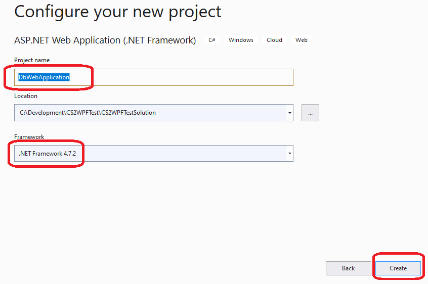

22. On "Create a new Asp.Net Web Application"-page select "Web Api" and click "Change Authentication"

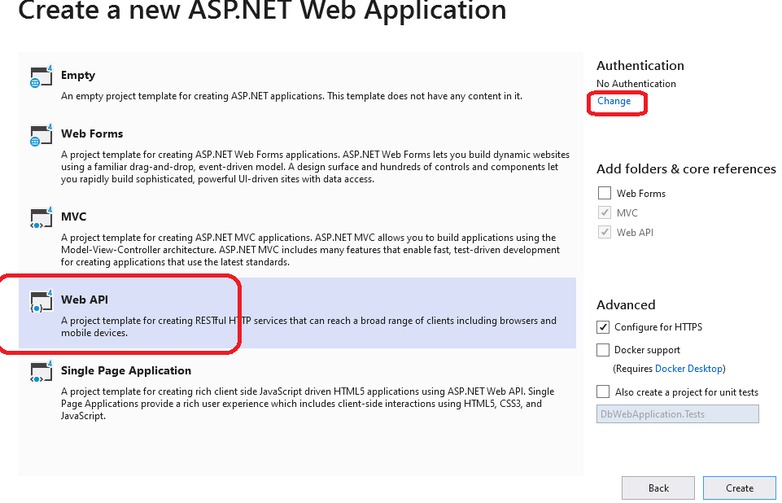

23. On "Change Authentication"-dialog select "Individual User Account" and click "Ok"-button

 

24. On "Create a new Asp.Net Web Application"-page click "Create"-button. The result should be like the picture below

 

## Creating projects to start front end development.

25. Right click "ServerProjects"-folder and "Add/New Project"

 

26. On the "Add New project" page select C#, type "Prism", choose "Prism blank App WPF"-item and click "Next"-button

 

27. On "Configure Your New Project"-page type "PrismTestApp", select "4.7.2" and click create

 

28. On "Prism project wizard"-dialog select unity and click "Create project"

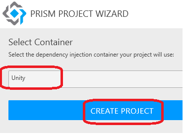 

29. Under "ClientProjects"-folder create two subfolders: "Shared" and "Models". The result should be like the picture below

 

30. Under "ClientProjects/Shared"-folder create two "Class library (Net Framework)" projects and name them: "CommonInterfacesClassLibrary" and "ModelInterfacesClassLibrary". (Repeat the steps 8-11 for "ClientProjects/Shared"-folder). The result should be like the picture below

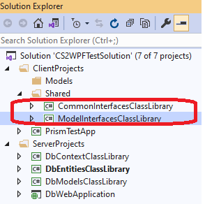 

31. Under "ClientProjects/Shared"-folder create "Wpf custom control library (Net Framework)" project. Name the project CommonWpfCustomControlLibrary.

 

32. In the CommonWpfCustomControlLibrary-project delete "CustomControl1.cs"-file
33. In the "Themes/Generic.xaml"-file of CommonWpfCustomControlLibrary-project remove Style definition of CustomControl1.cs

34. Under "ClientProjects/Shared"-folder create "Wpf User control library (Net Framework)" project. Name the project CommonWpfUserControlLibrary.

 

32. In the CommonWpfUserControlLibrary-project delete "UserControl1.xaml" and "UserControl1.xaml.cs"-files. 
33. The result should be like the picture below

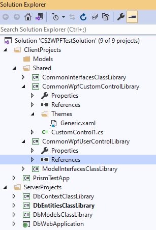 

34. Under "ClientProjects/Shared"-folder create "Prism module (Wpf)" project. Name the project CommonServicesPrismModule.

 

35. In the CommonServicesPrismModule-project delete "ViewModels" and "Views" folders.
38. In the CommonServicesPrismModuleModule.cs-file of CommonServicesPrismModule-project remove "using CommonServicesPrismModule.Views;"-line of code.
36. Under "ClientProjects/Models"-folder create "Prism module (Wpf)" project. Name the project ModelServicesPrismModule.

 

37. In the ModelServicesPrismModule-project delete "ViewModels" and "Views" folders.
38. In the ModelServicesPrismModuleModule.cs-file of ModelServicesPrismModule-project remove "using ModelServicesPrismModule.Views;"-line of code.

39. The result should be like the picture below

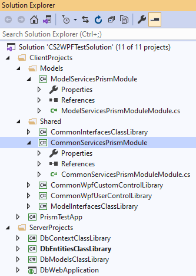 

40. Reset the output directory for the following projects:
- ModelServicesPrismModule.csproj
- CommonInterfacesClassLibrary.csproj
- CommonServicesPrismModule.csproj
- CommonWpfCustomControlLibrary.csproj
- CommonWpfUserControlLibrary.csproj
- ModelInterfacesClassLibrary.csproj

    - Right click each of the project and select "Properties"-menu.
    - Select "Build"-navigation menu
    - Type "..\PrismTestApp\bin\Debug\" in the "Output path"-control
    - Click "File\Save all"

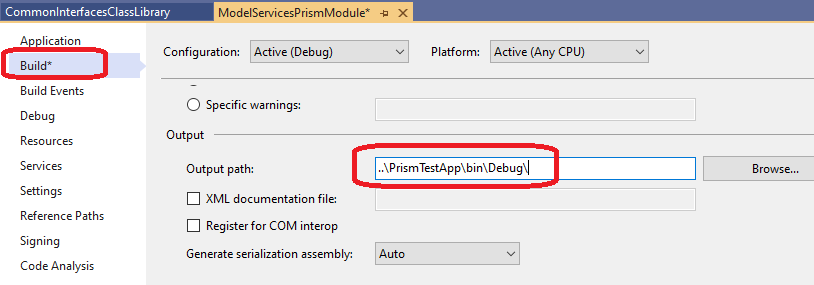 


## References of the front end projects.

41. For the PrismTestApp-project Add references onto:
- CommonInterfacesClassLibrary.csproj
- CommonWpfCustomControlLibrary.csproj
- CommonWpfUserControlLibrary.csproj
- ModelInterfacesClassLibrary.csproj

    - Right click the project node and select "Add/Reference..."-menu.
    - Select "Projects"-navigation menu
    - Check the projects above and click Ok-button

 

42. For the CommonWpfUserControlLibrary add references onto:
- CommonInterfacesClassLibrary.csproj
- CommonWpfCustomControlLibrary.csproj

43. For the CommonServicesPrismModule add references onto:
- CommonInterfacesClassLibrary.csproj
- CommonWpfCustomControlLibrary.csproj
- CommonWpfUserControlLibrary.csproj

44. For the ModelServicesPrismModule add references onto:
- CommonInterfacesClassLibrary.csproj
- CommonWpfCustomControlLibrary.csproj
- CommonWpfUserControlLibrary.csproj
- ModelInterfacesClassLibrary.csproj

## NuGet packages of the front end projects.

45. For the CommonWpfUserControlLibrary add references onto Prism.Wpf NuGet package

 

46. For the ModelServicesPrismModule add references onto "AutoCompleteTextBox" and  "Newtonsoft.json" NuGet packages

 

47. For the CommonInterfacesClassLibrary add references onto Newtonsoft.json NuGet packages
48. For the ModelInterfacesClassLibrary add references onto Newtonsoft.json NuGet packages

## NuGet packages of the back end projects.
49. For the DbEntitiesClassLibrary add references onto "System.ComponentModel.DataAnnotations"
50. For the DbContextClassLibrary add references onto "Entity Framework 6 (EF6)"  NuGet package
51. For the DbModelsClassLibrary add references onto "System.ComponentModel.DataAnnotations" and onto "Newtonsoft.json" NuGet package

 

## First entity and Dbcontext.
- Step #1:
    - Run Visual Studio and Open “CS2WPFTestSolution” solution
        - Add "Literature"-folder to DbEntitiesClassLibrary-project
        - Right Click “Literature” of the “DbEntitiesClassLibrary”-project
        - Select “Add/Class” menu item
        - In the dialog enter the name for the class
        - LitGenre
        - Click “Add”
- Step #2:
    - Open LitGenre file and modify the body of the class as it is shown on the slide
```java
public class LitGenre {
    [Display(Description = "Row id", Name = "Id of the genre", 
        Prompt = "Id of the genre", ShortName = "Genre Id")]
    [Required]
    public int GenreId { get; set; }

    [Display(Description = "Name of the genre", 
        Name = "Name of the genre", 
        Prompt = "Name of the genre", ShortName = "Genre Name")]
    [StringLength(20, MinimumLength = 3, 
        ErrorMessage = "Invalid")]
    [Required]
    public string GenreName { get; set; }
}
```

    - Note:
    - The following attributes are used by the Wizards to create Models and Wpf UserControls
        - Display
        - Required
        - StringLength
        - DatabaseGenerated
        - Range

- Step #3:
    - Add "Literature"-folder to DbContextClassLibrary-project
    - Right Click “Literature” of the “DbContextClassLibrary”-project and Select “DBContext Wizard” menu item to open the Wizard dialog

     

    - Note:
        - On the first page of the dialog the destination folder is shown. The destination folder is the folder in which the generated file will be created.
        - Click “Next”-button

    - Step #4:
        - On the second page of the dialog the developer should select existing DbContext file or create new one.
        - Since no DbContext is created, enter “LitDbContext” and click the “Create New DbContext” button

    

- Step #5:
    - On the third page of the dialog the developer should select the script to generate the code. There are two items in the list
        - DbContext.Net.cs.t4
        - DbContext.Net.Core.cs.t4

    


    - Select “DbContext.Net.cs.t4”
    - Click Next twice
    - Click “Save” button

    

    - Click “Next” to get the second page
- Step #6:
    - The developer is again on the second page. Now select the "Dm02Context" project and the "LitDbContext" context that has already been created. 

    

    - Click “Next” 

- Step #7:
    - On the third page select “DbEntitiesClassLibrary”-project and “LitGenre”-entity. 

    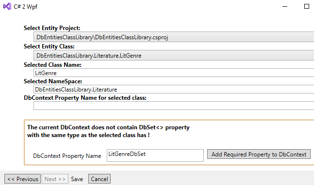

    - Click “Add required property to DbContext”
        - `DbSet<LitGenre>`
    - property will be added to the context

- Step #8:
    - On the same third page, the “Modify”-button became available. 
    - The developer must explicitly define the primary key. 

    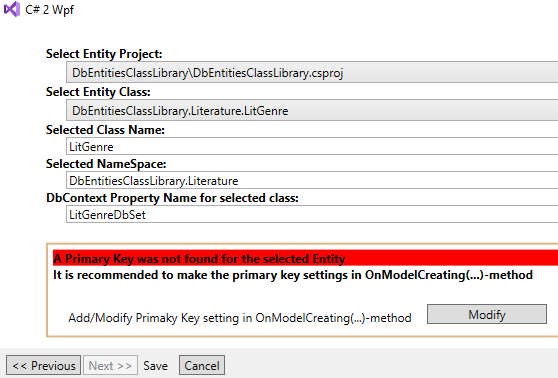

    - Click “Modify”

- Step #9:
    - Add ”GenreId” to the primary key list. 
    - Select “HasKey.Net.cs.t4” template
    - Click “Create(Modify)” button. It will add Fluent Api definition of the primary key for “LitGenre”.

    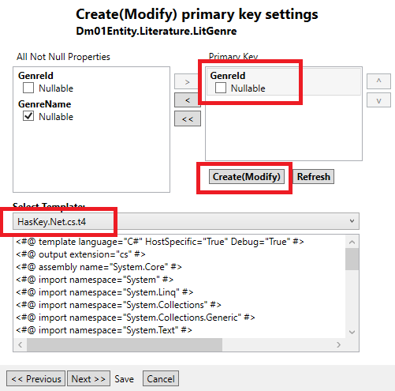

    ```java
    modelBuilder.Entity<LitGenre>().HasKey(p => p.GenreId);
    ```
- Step #10:
    - Open “LitDbContext.cs” file
    - Find the following method
    - `OnModelCreating(DbModelBuilder modelBuilder)`
    - And Insert the following line of code
    ```java
        modelBuilder.Entity<LitGenre>()
        .Property(p => p.GenreId)
        .HasDatabaseGeneratedOption(DatabaseGeneratedOption.None);
    ```
    - This gives a hint that GenreId is not an Identity

## First View and Wizard repository.
- View (or ModelView) is the structure that the Web Api service sends to and receives from the client. For each entity, the developer must create at least one view.
- To Add a View to the project 
    - Run Visual Studio and Open “CS2WPFTestSolution” solution
    - Create “Literature”-folder under “DbModelsClassLibrary”-project
    - Right Click “Literature” of the “DbModelsClassLibrary”-project and select “ModelView Wizard” menu item to open the Wizard dialog

- Note:
    - On the first page of the dialog the destination folder is shown. The destination folder is the folder in which the generated file will be created.

    
    
    - Click “Next”-button


- On the second page of the dialog the developer should select existing DbContext file. 
    - Select:
        - DbContextClassLibrary (project)
        - LitDbContext (context)

    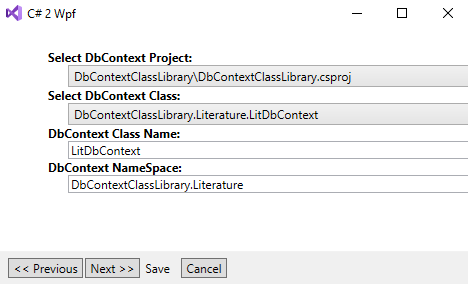

    - Click “Next”-button

- On the third page of the dialog the developer should select entity file. 	 
    - Select:
        - DbEntitiesClassLibrary 
        - LitGenre 

    

    - Click “Next”-button

- On the fourth page of the dialog the developer can select existing view for modification.
    - Uncheck “Select View”

    


    - Click “Next”-button

- On the fifth page select root node and check “Generate JsonProperty Attribute”.
    - Two classes will be generated:
    - “View” and “Page View”. 
    - The last one is used by pagination.

    
    
    - Leave these names unchanged. 

- On the fifth page check “Is Selected” for “GenreId” and “GenreName” nodes. Leave “Property Name” and “Json Property Name” unchanged.

    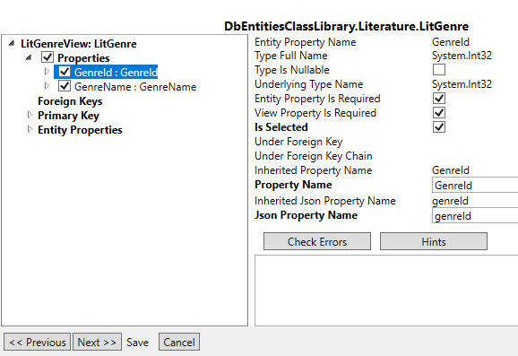

    - Click “Next”

- On the sixth page select “ViewModel.cs.t4” 

    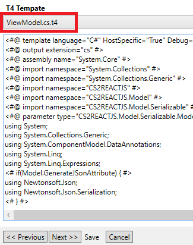

    - click Next

- On the seventh page click “Save”. 
    - Open “C:\Development\Demo\DmLit” which is a root of the solution. 

    
    
    - New “.json” file has been created. This is the repository of the wizards.

    

    - Click “Next”

- On the eighth page select “ViewModelPage.cs.t4” and click Next. 

    

    - It generates the second class

- On the ninth page click save and close the dialog. The repository (.json) file has been updated again.

    

    - Note #1:
        - The repo file is updated only when you click the save button.
    - Note #2:
        - A separate repo file is created for each DBContext.

## First Web Api Service.
- Before generating Web Api service the developer must define the set of View’s properties that will be used for filtering and the set of View’s properties that will be used for sorting.
- To Generate Web Api service
    - Run Visual Studio and Open “CS2WPFTestSolution” solution
    - Right Click “Controllers”-folder of the “DbWebApplication”-project and select “WebApiServices Wizard” menu item to open the Wizard dialog

- Note:
    - On the first page of the dialog the destination folder is shown. The destination folder is the folder in which the generated file will be saved.

    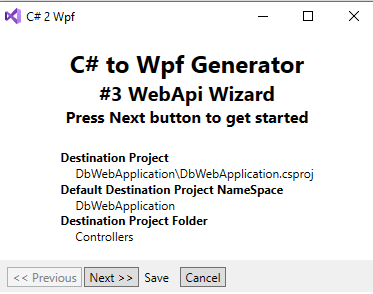

    - Click “Next”-button

- On the second page of the dialog the developer should select existing DbContext file. Select:
    - DbContextClassLibrary (project)
    - LitDbContext (context)

    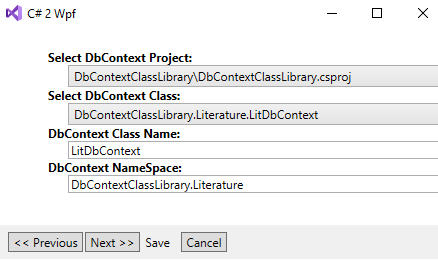

    - Click “Next”-button

- On the third page of the dialog the developer should select the View. 
    - Select:
        - LitGenreView 

    

- On the third page of the dialog the developer should define Properties for filtering and sorting. For our view, “Is used by filter” and “Is used by sorting” must be checked for:
    - GenreId 
    - GenreName

    


- On the third page of the dialog the developer should define the Web Api methods to generate. For our view all methods is checked

    

    - Click “Next”

- On the fourth page of the dialog the developer should select T4-script to generate Web Api Service. Only “DefaultWebApiService.cs.t4” must be selected for this purpose. Other scripts are used for the security

    

    - Click “Next”

- On the fifth page of the dialog the developer should click “Save” and close the dialog.

    

- Note:
    - The Wizard’s repo file is updated only when you click “save” button

- After generating very first Web Api service the developer must add references on Entity’s, Context’s and View’s projects.
    - In out case, we should add references on
        - DbEntitiesClassLibrary
        - DbContextClassLibrary
        - DbModelsClassLibrary    

    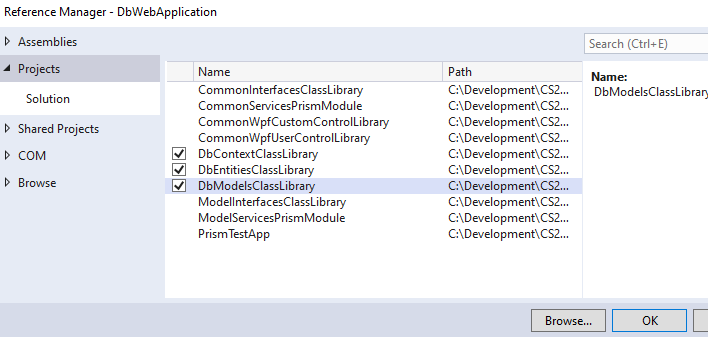


